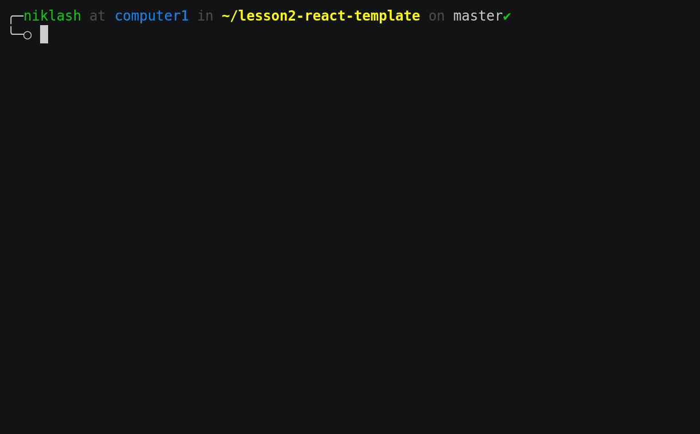

# Koodi101 Project Template

## Forking and cloning the repository

Start by forking the repository

> If you work in a group, only one person needs to fork the repository.
> The others need to be members of the repository. See [collaborating with other users](#collaborating)

Then clone the forked repository using SSH

```bash
git clone git@github.com:<user>/project-template.git
```

> When you use SSH to clone a repository, you need a [private key](https://help.github.com/en/github/authenticating-to-github/generating-a-new-ssh-key-and-adding-it-to-the-ssh-agent) on your account which is authorized to pull (read) the repository.
>
> Using SSH allows you to push (write) to the repository without providing you username and password! Handy, right?

## Running the project

Start by going to the cloned repository in a terminal

```bash
cd project-template
```

Then build the docker images and start the services

```bash
docker-compose build
docker-compose up
```

Or with a single command

```bash
docker-compose up --build
```

> Hit Ctrl+C to stop the processes

<details>
<summary> Optionally you can run the process in the background </summary>
<br>

Add `-d` to the docker-compose commands.

```bash
docker-compose build
docker-compose up -d
```

Or with a single command

```bash
docker-compose up --build -d
```

> `-d` comes from the word _detached_

To see if the project is running

```bash
docker-compose ps
```

To stop the running background processes and remove the built images

```bash
docker-compose down --rmi all --remove-orphans
```

> If the processes are not running `docker-compose down` also removes the _containers_ and images

If you don't want to remove the images, you can just run

```bash
docker-compose down
```

</details>

## Running the project with only Node.js

Use this [repository](https://github.com/koodi101/project-template-without-containers) instead.

## Collaborating

Collaboration is the heart of Open Source software development in GitHub.

> Only the owner of the forked repository in your group needs to add the collaborators

After creating/forking a repository, owner may add collaborators to it alternatively in the GitHub repository page by clicking `settings -> collaborators` or by going to the web page by the following URL where `<username>` is replaced by a repository owner's username

```bash
https://github.com/<username>/project-template/settings/access
```

And, by searching usernames of other students (collaborators), owner can invite them as group members to allow them pushing (making changes) to the repository.

Upon inviting your group members, they will receive the invitation via email. Only after accepting the invitation will they be able to push to the repository.

### Collaborating example

- Niklash on is making changes to [`src/index.jsx`](src/index.jsx), committing them and finally pushing them to GitHub.



> Git commands used:
>
> - `git add`
> - `git diff`
> - `git status`
> - `git commit -m "message"`
> - `git push`

- Severi is then pulling the changes and viewing them.


> Git commands used:
>
> - `git pull`
> - `git show`
